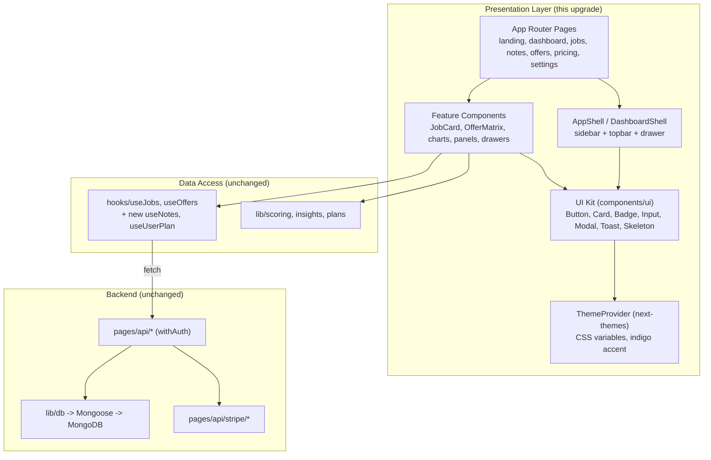
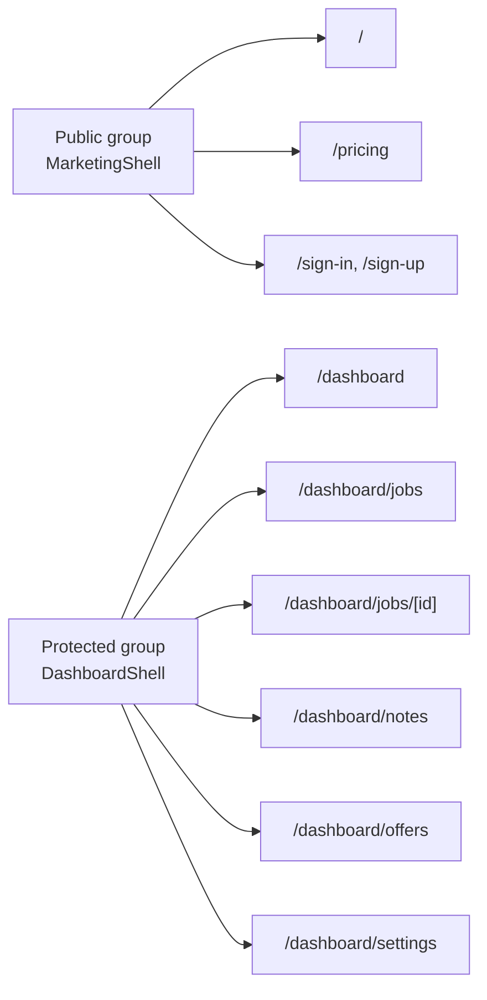
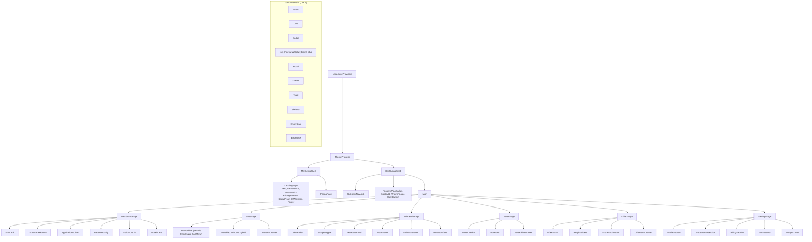
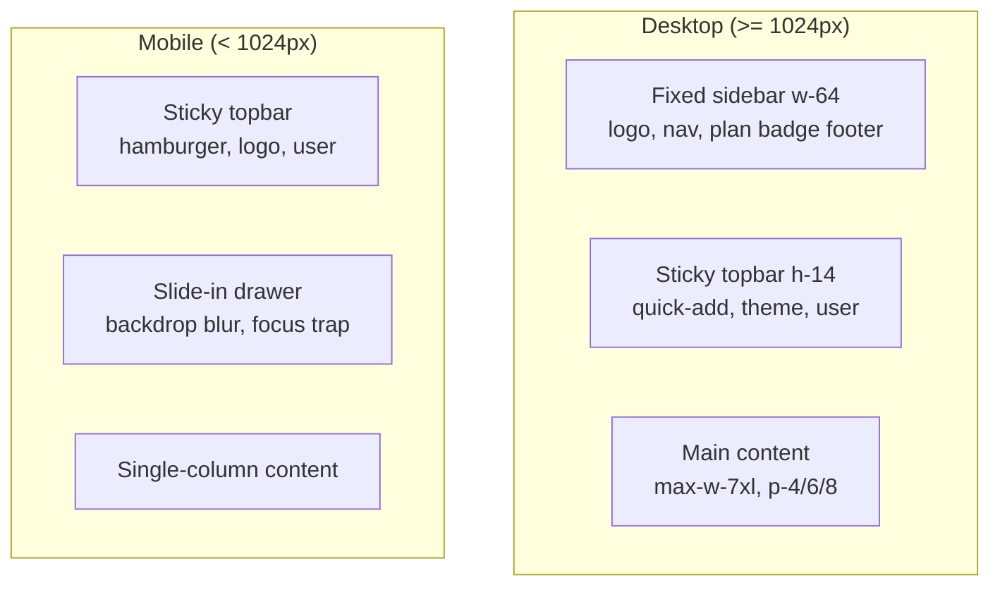
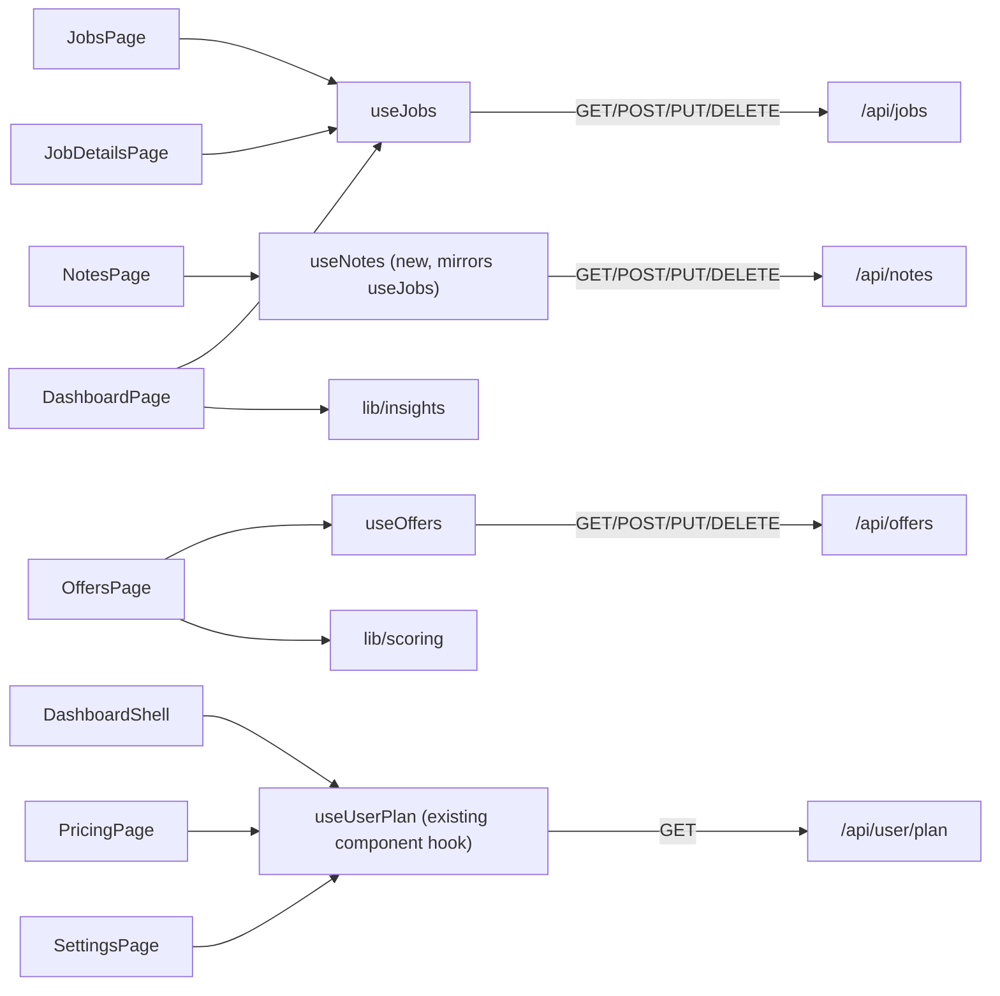
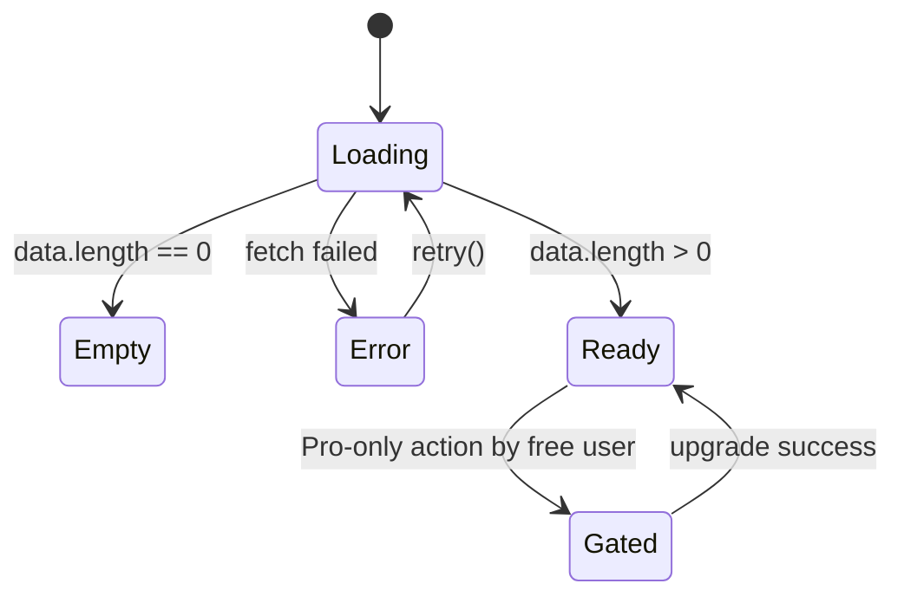

# Design Document: TrackIQ Pro UI Upgrade

## Overview

TrackIQ Pro is an existing Next.js (Pages Router for API, App Router for UI) + TypeScript + Tailwind SaaS app for tracking job/internship applications, keeping private interview notes, comparing offers with a weighted scoring engine, exporting data, and managing premium billing (Stripe + Clerk). This effort is a **UI/UX upgrade only**: we are lifting eight surfaces (Landing, Dashboard, Jobs, Job Details, Offers, Notes, Pricing/Billing, Settings) to a production-grade premium SaaS experience while **preserving the existing data layer, REST API, scoring/insights engines, and theme system**.

The design treats the UI as a presentation layer that sits on top of the unchanged `pages/api/*` endpoints and the existing `useJobs` / `useOffers` data hooks. No database schema, model, or API contract changes. The work is a refactor and expansion of the `components/` directory plus the App Router pages, refining structure already established by the Google Stitch premium reference screens (project `3095733913998128134`) rather than redesigning from scratch.

Visual direction: a calm, content-first premium SaaS aesthetic with an indigo brand accent, full light/dark parity, `rounded-2xl` cards and `rounded-lg` controls, fixed desktop sidebar + sticky topbar + mobile drawer, subtle motion that respects `prefers-reduced-motion`, and theme-aware charts. Reference benchmarks: Linear (dashboard/nav clarity), Stripe (pricing/billing polish), Notion (notes/table readability), Vercel (marketing/landing structure). We deliberately avoid childish gradients, heavy glassmorphism, clutter, and emoji icons.

## Stitch Reference Mapping

Each in-scope page refines an existing premium Stitch screen. We preserve the structure and intent and refine to production quality (real data, states, accessibility, theme parity).

| Page | Stitch Screen | screenId |
|------|---------------|----------|
| Landing | Premium Landing Page | `ec3be286a8d241fea7907aa0cdd7e7d8` |
| Dashboard | Premium Dashboard | `b1a988b4e11047a7ac5600b5670f277a` |
| Jobs | Premium Jobs Explorer | `22c292b9d45d41fcb52b3b44a7e19f32` |
| Job Details | Premium Job Details | `fb2109f2842f4371b5fe103f2ffe66d9` |
| Offers | Premium Offer Comparison | `1c605c4b5b4a43ccbf80ce165157dc25` |
| Notes | Premium Interview Notes | `b8ec07575465483891c095225f8e5db4` |
| Pricing/Billing | Premium Pricing & Billing | `4915f0d7866640a5a7ef682f2cf08b27` |
| Settings | Settings | `83c233d8522d4876a31e1ed465d569b1` |

> The Stitch MCP server (`.kiro/settings/mcp.json`) exposes `list_screens`, `get_screen`, `fetch_screen_code`, `fetch_screen_image`, `extract_design_context`. During implementation these are the source of truth for layout fidelity per screen. Where MCP tools are unavailable in-session, they can be invoked via the Stitch JSON-RPC endpoint with `gcloud` auth (`GOOGLE_CLOUD_PROJECT=project-6f9af12d-507c-4ba0-af2`). The design below encodes structure and intent so implementation does not depend on live MCP access.

## Architecture

### How the UI layer sits on top of the existing stack

The upgrade is confined to the presentation tier. Authentication (Clerk middleware + `withAuth`), the REST surface, the Mongoose models, and the billing flow are untouched.



### Routing & navigation model

Routes are unchanged from `APP_FLOW.md`. The shell decides chrome based on route group.



- **MarketingShell**: floating/sticky topbar with logo, nav anchors, theme toggle, sign-in / "Get started" CTAs; no sidebar; footer.
- **DashboardShell** (existing, refined): fixed 64-unit (`w-64`) sidebar on `lg+`, sticky `h-14` topbar, mobile drawer below `lg`. Adds a plan-status indicator and quick-add affordance in the topbar.
- Navigation state derives from `usePathname()` (already implemented). Active link styling uses the indigo-filled treatment already in `DashboardShell`.

## Component Hierarchy



## Layout Shell Design



- Desktop: `lg:pl-64` content offset (already implemented), sticky topbar with `z-20`.
- Mobile: drawer with `bg-black/50` backdrop (refined to `backdrop-blur-sm`), Escape-to-close, focus trap, body scroll lock. Reuses the existing `mobileOpen` pattern in `DashboardShell`.
- The shell is theme-aware via the `.surface` / CSS-variable classes already defined in `globals.css`.

## Design Tokens & Theming

Theming stays on the existing `ThemeProvider` (next-themes, `attribute="class"`, `.dark` variant) and the CSS variables already defined in `docs/DESIGN.md`. No token system is replaced; we formalize and reuse it.

| Token | Light | Dark | Usage |
|-------|-------|------|-------|
| `--bg` | `#f6f7fb` | `#0a0b14` | App background |
| `--surface` | `#ffffff` | `#12131f` | Cards, sidebar, topbar |
| `--surface-2` | `#f1f3f9` | `#1a1c2b` | Inset/hover surfaces |
| `--text` | `#0f172a` | `#f1f5f9` | Primary text |
| `--text-muted` | `#475569` | `#94a3b8` | Secondary text (meets 4.5:1) |
| `--border` | `#e2e8f0` | `#262a3d` | Card/control borders |
| `--accent` | `#6366f1` | `#818cf8` | Indigo brand accent |

**Scales**
- Radii: cards `rounded-2xl`, controls/inputs/buttons `rounded-lg`, pills `rounded-full`.
- Spacing: page container `max-w-7xl`, padding `p-4 sm:p-6 lg:p-8`; card padding `p-4`/`p-6`; grid gaps `gap-4`/`gap-6`.
- Elevation: `shadow-sm` default; `shadow-md` for popovers/drawers; never heavy shadows.
- Typography: system UI / DM Sans stack; page title `text-2xl font-bold`, section `font-semibold`, body `text-sm`, meta `text-xs text-muted`.
- Status tones (existing `Badge` map): applied=blue, screening=amber, interview=violet, offer/accepted=emerald, rejected=rose, withdrawn=slate, pending=amber, pro=indigo.

**Indigo accent rule:** the brand accent is indigo (`indigo-600` light / `indigo-400`–`500` dark) for primary buttons, active nav, focus rings, and chart series — matching the existing `Button` primary and `DashboardShell` active state. (The auxiliary design-system helper suggested a blue/green palette; we keep indigo per product brand and the existing theme to avoid a jarring rebrand.)

## Components and Interfaces

This section defines the props/contract for key UI components. All consume existing hooks/`lib` functions; none change the API or schema. Types reference the shared interfaces in `types/index.ts` (`Job`, `Offer`, `Note`) and `lib/plans` / `lib/scoring`.

### Component: AppShell / MarketingShell

**Purpose**: Public-route chrome (topbar + footer) for Landing and Pricing.

```typescript
interface MarketingShellProps {
  children: React.ReactNode;
  activeAnchor?: "features" | "how-it-works" | "pricing";
}
```

**Responsibilities**: sticky topbar with theme toggle + auth CTAs; footer; no auth dependency.

### Component: DashboardShell (refined existing)

**Purpose**: Protected-route chrome.

```typescript
interface DashboardShellProps {
  children: React.ReactNode;
}
// Internally consumes useUserPlan() for the PlanBadge and gating cues.
```

**Responsibilities**: fixed sidebar, sticky topbar, mobile drawer, plan badge, quick-add entry point, theme toggle, Clerk `UserButton`.

### Component: StatCard (refined existing)

```typescript
interface StatCardProps {
  label: string;
  value: string | number;
  delta?: { value: number; direction: "up" | "down" | "flat" };
  icon?: React.ReactNode;
  hint?: string;
  loading?: boolean; // renders Skeleton variant
}
```

### Component: JobsToolbar (new)

```typescript
type JobSort = "recent" | "company" | "salary";
type StageFilter = Job["stage"] | "all";

interface JobsToolbarProps {
  query: string;
  onQueryChange: (q: string) => void;
  stage: StageFilter;
  onStageChange: (s: StageFilter) => void;
  sort: JobSort;
  onSortChange: (s: JobSort) => void;
  resultCount: number;
}
```

**Responsibilities**: debounced search input, filter chips per stage, sort dropdown. Filtering/sorting is **client-side** over the array returned by `useJobs()` (no API change).

### Component: JobTable / JobCard hybrid (refined existing JobCard)

```typescript
interface JobTableProps {
  jobs: Job[];
  loading: boolean;
  error: string | null;
  onRetry: () => void;
  onOpen: (id: string) => void;          // navigate to /dashboard/jobs/[id]
  onEdit: (job: Job) => void;            // open JobFormDrawer
  onDelete: (id: string) => void;        // useJobs().deleteJob
}
```

**Responsibilities**: dense table on `md+`, stacked cards on mobile; stage `Badge`; row actions (open/edit/delete); skeleton, empty, and error states.

### Component: JobFormDrawer (new; wraps existing Modal pattern)

```typescript
interface JobFormDrawerProps {
  open: boolean;
  mode: "create" | "edit";
  initial?: Partial<Job>;
  onClose: () => void;
  onSubmit: (input: JobInput) => Promise<void>; // useJobs().createJob / PUT
  planGate?: { atLimit: boolean; limit: number; isPro: boolean };
}
```

**Responsibilities**: accessible labeled form (title, company, location, stage, status, salary, link, description, notes); when `planGate.atLimit && !isPro`, shows the upgrade prompt instead of submit (mirrors server-side free-limit enforcement).

### Component: StageStepper (new)

```typescript
interface StageStepperProps {
  current: Job["stage"];
  onChange: (next: Job["stage"]) => void; // PUT /api/jobs/[id]
  disabled?: boolean;
}
// Order: applied -> screening -> interview -> offer -> accepted
//        with rejected / withdrawn as terminal branches.
```

### Component: OfferMatrix (refined existing)

```typescript
interface OfferMatrixProps {
  offers: Offer[];
  weights: Weights;                 // from lib/scoring
  onWeightsChange: (w: Weights) => void;
  onEdit: (offer: Offer) => void;
  onDelete: (id: string) => void;
  onExport: () => void;             // gated: Pro only
  isPro: boolean;
}
// Derives scored rows via scoreOffers(offers, weights); highlights isBest.
```

### Component: WeightSliders (new)

```typescript
interface WeightSlidersProps {
  weights: Weights;                 // { salary, equity, growth, brand }
  onChange: (w: Weights) => void;   // live recompute; normalized on render
  labels: Record<keyof Weights, string>; // weightLabels from lib/scoring
}
```

### Component: ScoreExplanation (new)

```typescript
interface ScoreExplanationProps {
  weights: Weights;
  text: string; // scoreExplanation(weights) from lib/scoring
}
```

### Component: NoteGrid + NoteEditorDrawer (new; JobCard-style)

```typescript
interface NoteGridProps {
  notes: Note[];
  loading: boolean;
  error: string | null;
  onOpen: (note: Note) => void;
  onDelete: (id: string) => void;
}

interface NoteEditorDrawerProps {
  open: boolean;
  mode: "create" | "edit";
  initial?: Partial<Note>;
  jobs: Job[];                       // for the "linked job" selector
  onClose: () => void;
  onSubmit: (input: NoteInput) => Promise<void>;
}
```

### Component: UpsellCard / LockedFeature (refined existing)

```typescript
interface UpsellCardProps {
  title: string;
  description: string;
  ctaHref?: string;                  // /pricing
  variant?: "card" | "inline" | "overlay";
}
```

### Component: PricingTable (new)

```typescript
interface PricingTableProps {
  currentPlan?: Plan;                // from useUserPlan
  onUpgrade: () => void;             // POST /api/stripe/checkout
  onManageBilling: () => void;       // POST /api/stripe/portal
}
```

## Data Models

UI components consume the existing data shapes; this section documents how those models flow into the presentation layer. No DB or API changes. UI consumes existing shapes (`docs/SCHEMA.md`) and hooks.



**New hook to add (mirrors existing pattern, no API change):**

```typescript
// hooks/useNotes.ts — same shape as useJobs/useOffers
type NoteInput = Partial<Omit<Note, "_id" | "userId">>;
interface UseNotes {
  notes: Note[];
  loading: boolean;
  error: string | null;
  fetchNotes: (jobId?: string) => Promise<void>; // optional ?jobId= filter (already supported)
  createNote: (input: NoteInput) => Promise<Note>;
  updateNote: (id: string, input: NoteInput) => Promise<Note>;
  deleteNote: (id: string) => Promise<void>;
}
```

Client-side derivations (no new endpoints):
- **Search/filter/sort (Jobs, Notes):** computed over the hook array with `useMemo`.
- **Offer scoring:** `scoreOffers(offers, weights)` + `scoreExplanation(weights)` from `lib/scoring`.
- **Follow-up suggestions / KPIs / charts:** derived from jobs via `lib/insights`.

## Per-Page Component Composition

### 1. Landing (`/`) — MarketingShell

Sections (Vercel-style structure, Stitch `ec3be286...`): Hero (headline, subcopy, primary CTA "Get started", secondary "See pricing", product preview), FeatureGrid (tracking, notes, comparison, analytics, premium — 5 `Card`s with SVG icons), HowItWorks (3 steps), PricingPreview (Free vs Pro mini-table linking to `/pricing`), SocialProof (testimonial/logos), CTASection, Footer.
- New: `Hero`, `FeatureGrid`, `HowItWorks`, `PricingPreview`, `SocialProof`, `CTASection`, `Footer`. Reuses `Button`, `Card`, `Badge`, icons.

### 2. Dashboard (`/dashboard`)

Layout (Linear-style density, Stitch `b1a988b4...`): KPI row (4 `StatCard`s: total apps, interview rate, offers, active), two-column charts (`StatusBreakdown` doughnut + `ApplicationsChart` timeline), `RecentActivity` table, `FollowUpList` (from `lib/insights`), `QuickActions`, `UpsellCard` (free users), `PlanBadge`.
- Reuses: `StatCard`, `StatusBreakdown`, `ApplicationsChart`, `RecentActivity`. New: `FollowUpList`, `QuickActions`, `UpsellCard`.

### 3. Jobs (`/dashboard/jobs`)

`JobsToolbar` (search + filter chips + sort) → `JobTable`/`JobCard` hybrid → `JobFormDrawer`. States: skeleton rows, `EmptyState` ("Add your first application"), `ErrorState` with retry.
- Reuses: `JobCard`, `Badge`, `Modal`. New: `JobsToolbar`, `JobTable`, `JobFormDrawer`.

### 4. Job Details (`/dashboard/jobs/[id]`)

`JobHeader` (company/role/stage) → `StageStepper` → `MetadataPanel` (location, salary, link, dates) → `NotesPanel` (notes linked via `?jobId=`) → `FollowUpPanel` (reminders) → `RelatedOffers` → edit/delete actions.
- New: `JobHeader`, `StageStepper`, `MetadataPanel`, `NotesPanel`, `FollowUpPanel`, `RelatedOffers`.

### 5. Offers (`/dashboard/offers`)

`OfferMatrix` (comparison table/cards, best-offer highlight) + `WeightSliders` + `ScoreExplanation` + export button (Pro-gated) + add-offer drawer. Empty state when no offers.
- Reuses: `OfferMatrix`. New: `WeightSliders`, `ScoreExplanation`, `OfferFormDrawer`.

### 6. Notes (`/dashboard/notes`)

`NotesToolbar` (search + tag/round chips) → `NoteGrid` (Notion-style readable cards with job + round badges) → `NoteEditorDrawer` (title, linked job, round, content). Empty/loading/error states.
- New: `NotesToolbar`, `NoteGrid`, `NoteEditorDrawer`, `useNotes`.

### 7. Pricing/Billing (`/pricing`) — MarketingShell

Stripe-style polish: `PricingTable` (Free vs Pro, feature rows, highlighted Pro), upgrade CTA (`UpgradeToProButton`), manage-billing CTA (`ManageBillingButton`), Pro feature callouts, trust/FAQ section.
- Reuses: `UpgradeToProButton`, `ManageBillingButton`, `Card`, `Badge`. New: `PricingTable`, `TrustSection`.

### 8. Settings (`/dashboard/settings`)

Sectioned form layout (Stitch `83c233d8...`): `ProfileSection` (Clerk-managed), `AppearanceSection` (theme toggle), `BillingSection` (plan status + manage billing), `DataSection` (export, Pro-gated), `PrivacySection`, `DangerZone` (account actions).
- Reuses: `ThemeToggle`, `ManageBillingButton`, `LockedFeature`. New: section wrappers.

## States (loading / empty / error / premium-gated)

Every data view implements four states using the existing primitives.



- **Loading**: `Skeleton` shimmer matching final layout (rows, cards, chart blocks).
- **Empty**: `EmptyState` with SVG icon, copy, and a primary CTA.
- **Error**: `ErrorState` with `onRetry` wired to the hook's `fetch*`.
- **Premium-gated**: `LockedFeature` / `UpsellCard` overlay; gated actions are export (Pro-only) and creating jobs beyond `FREE_JOB_LIMIT` (mirrors server enforcement via `lib/plans.isPro`).

## Charts Approach

- **Library**: Chart.js + `react-chartjs-2` (already the project's choice per TRD). Reuse `ApplicationsChart` (line/timeline) and `StatusBreakdown` (doughnut).
- **Theme-aware**: read CSS variables / `resolvedTheme` to set tick, grid, and label colors so charts read in both modes; series use the indigo accent plus the status tone palette. Slate-neutral grids/ticks.
- **Accessibility**: every chart paired with an accessible summary (visually-hidden text or a small legend/table) so data is not conveyed by color alone; respects `prefers-reduced-motion` by disabling chart animations when set.

## Accessibility & Responsive Strategy

- **Forms**: every input uses the existing `Label` / `Field` primitives; hints via `aria-describedby`.
- **Focus**: `focus-visible` rings (indigo) already standard on `Button`/inputs; drawers/modals trap focus, restore on close, and close on Escape (existing `Modal` behavior extended to drawers).
- **Color independence**: status uses text + tone (existing `Badge`), never color alone.
- **Landmarks**: `header`, `nav`, `main`, `footer`; mobile drawer uses `role="dialog"` + `aria-modal`.
- **Responsive breakpoints**: 375 / 768 / 1024 (sidebar appears) / 1440 (max content). Tables collapse to cards below `md`; grids reflow to single column; no horizontal scroll on mobile.
- **Targets**: interactive elements meet comfortable hit areas; `cursor-pointer` on all clickable surfaces.

## Motion / Reduced-Motion Strategy

- Framer Motion for page/section reveals and list stagger; durations 0.18–0.5s; easing subtle.
- Hover uses color/opacity transitions (200–250ms), never layout-shifting scale transforms.
- A global `prefers-reduced-motion: reduce` guard disables non-essential animations (page reveals, stagger, chart animation), keeping instant state changes.

## Reuse vs. New-Build Analysis

Assessed against the current `components/` directory.

| Existing component | Action | Notes |
|--------------------|--------|-------|
| `components/ui/primitives.tsx` (Button, Card, Badge, Input, Textarea, Select, Field, Label, Spinner, Skeleton, EmptyState, ErrorState) | **Reuse as-is** | Complete kit; satisfies the component-system requirement. |
| `components/ui/Modal.tsx` | **Reuse + extend** | Add a `Drawer` variant (side sheet) sharing focus-trap/backdrop logic. |
| `components/ui/Toast.tsx` | **Reuse** | Success/error/info for mutations. |
| `components/ui/icons.tsx` | **Reuse + extend** | Add any missing SVG icons (search, filter, sort, sliders, export). No emoji. |
| `DashboardShell` | **Refine** | Add PlanBadge + quick-add; refine drawer to `backdrop-blur`. |
| `Navbar` | **Refine -> MarketingShell** | Repurpose for public topbar/footer. |
| `JobCard` | **Refine** | Used in mobile/list and as basis for `JobTable` rows. |
| `OfferMatrix` | **Refine** | Wire `WeightSliders` + `ScoreExplanation`; best-offer highlight. |
| `StatCard`, `StatusBreakdown`, `ApplicationsChart`, `RecentActivity` | **Refine** | Add loading/skeleton variants; theme-aware chart colors. |
| `LockedFeature`, `UpgradeToProButton`, `ManageBillingButton` | **Reuse** | Power gating + billing CTAs. |
| `ThemeProvider`, `ThemeToggle` | **Reuse as-is** | Theming unchanged. |
| `useUserPlan` (component hook) | **Reuse** | Drives PlanBadge/gating. |
| `hooks/useJobs`, `hooks/useOffers` | **Reuse as-is** | Data access unchanged. |
| `lib/scoring`, `lib/insights`, `lib/plans` | **Reuse as-is** | Pure logic; UI consumes outputs. |

**New components to build**: `MarketingShell` (+ Landing sections: Hero, FeatureGrid, HowItWorks, PricingPreview, SocialProof, CTASection, Footer), `JobsToolbar`, `JobTable`, `JobFormDrawer`, `StageStepper`, `MetadataPanel`, `NotesPanel`, `FollowUpPanel`/`FollowUpList`, `RelatedOffers`, `JobHeader`, `WeightSliders`, `ScoreExplanation`, `OfferFormDrawer`, `NotesToolbar`, `NoteGrid`, `NoteEditorDrawer`, `PricingTable`, `TrustSection`, Settings sections, `UpsellCard`, `QuickActions`, `PlanBadge`, and the `Drawer` primitive.

**New hook**: `hooks/useNotes` (mirrors `useJobs`; uses existing `/api/notes` incl. `?jobId=`).

## Optional AI-Assisted Section

A non-blocking "Job-fit / Offer-ranking insights" panel may appear on Dashboard/Offers, surfacing the deterministic `lib/scoring` + `lib/insights` outputs as plain-language guidance (no new model dependency required). It is presented as an optional, Pro-gated card and does not alter data contracts.

## Correctness Properties

These are UI-level invariants the upgraded surfaces must uphold (validated later via tests during the requirements/implementation phases):

### Property 1: Theme parity
Every page renders legibly in both light and dark mode; no element relies on a single theme's contrast. Text and muted text meet WCAG AA (4.5:1).

### Property 2: State coverage
Every data view resolves to exactly one of {loading, empty, error, ready}, and a Pro-gated action additionally resolves to {gated, allowed} based on `isPro` and `FREE_JOB_LIMIT`.

### Property 3: Gating consistency
The UI never enables a Pro-only action (export, jobs beyond the free limit) for a free user; the UI gate mirrors the server's authoritative enforcement (UI gate is advisory, server is source of truth).

### Property 4: Scoring fidelity
Offer ranking and best-offer highlight are exactly the output of `scoreOffers(offers, weights)`; the UI performs no independent scoring math. Adjusting weights re-derives scores deterministically.

### Property 5: Data isolation
The UI only renders data returned by the authenticated hooks; no user-identifying value is ever read from the client to scope queries.

### Property 6: Navigation correctness
The active nav item matches the current route per the `isActive` rule; public vs. protected chrome matches the route group.

### Property 7: Reduced motion
When `prefers-reduced-motion: reduce` is set, no non-essential animation runs.

## Error Handling

| Scenario | Condition | UI Response | Recovery |
|----------|-----------|-------------|----------|
| Fetch failure | Hook `error` set (network/DB/500) | `ErrorState` card with message | `onRetry` calls hook `fetch*` |
| Mutation failure | create/update/delete rejects | Error `Toast`; form/drawer stays open with values | User retries; optimistic update rolled back |
| Free-limit reached | `createJob` returns limit error / `atLimit` true | Inline upgrade prompt in `JobFormDrawer` | Link to `/pricing` |
| Pro-gated action | Free user invokes export | `LockedFeature` / `UpsellCard` overlay | Upgrade flow |
| Empty result | `data.length === 0` | `EmptyState` with primary CTA | Create first item |
| Auth lapse | 401 from API | Redirect to sign-in (Clerk middleware) | Re-authenticate |
| Billing/Stripe error | checkout/portal request fails | Error `Toast` with friendly copy | Retry CTA |

All mutations surface a success `Toast` on resolution (per `APP_FLOW.md`).

## Testing Strategy

### Unit / Component Testing
- Render each component in loading, empty, error, ready, and gated states.
- Toolbar logic: search/filter/sort produce the correct subset/order over a fixed jobs array.
- `WeightSliders` → `OfferMatrix` integration: changing weights re-derives `scoreOffers` output and updates the `isBest` highlight.
- Form drawers: validation, accessible labels, submit wiring to hooks, free-limit gating branch.

### Accessibility Testing
- Automated axe checks per page; manual keyboard traversal (focus rings, Escape-to-close, focus trap/restore in drawers/modals).
- Contrast audit of tokens in both themes; verify status conveyed by text + tone.
- Note: full WCAG conformance requires manual testing with assistive technologies and expert review.

### Visual / Responsive Testing
- Snapshot/visual checks at 375 / 768 / 1024 / 1440 in both themes.
- Verify table→card collapse, sidebar→drawer transition, no horizontal scroll on mobile.

### Property-Based Testing (where valuable)
- **Library**: fast-check (TypeScript).
- Candidate properties: for any random offer set + weights, the highlighted best offer equals `argmax(scoreOffers(...).score)`; for any jobs array, filter+sort never adds/removes items beyond the predicate and ordering is a stable permutation of the matches.

## Out of Scope

- Database schema, Mongoose models, and REST API contracts (unchanged).
- Auth/middleware and the Stripe billing flow logic (unchanged).
- Theming engine replacement (we reuse `ThemeProvider` + CSS variables).
- Job-board scraping, team/multi-user features (per PRD non-goals).

## Open Questions

1. Should Jobs filtering/sorting remain client-side (current hooks return the full set) or move to query params on `/api/jobs` (would touch the API — currently excluded)?
2. Editor depth for Notes — plain `Textarea` (matches current schema's `content: string`) vs. a richer markdown editor?
3. Should the AI-assisted insights panel ship in this UI upgrade or be deferred to a follow-up spec?
